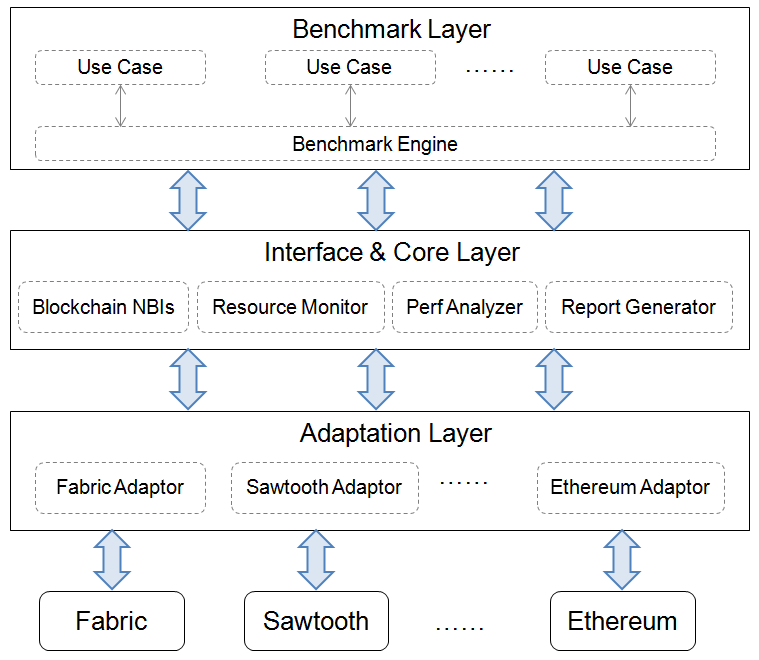
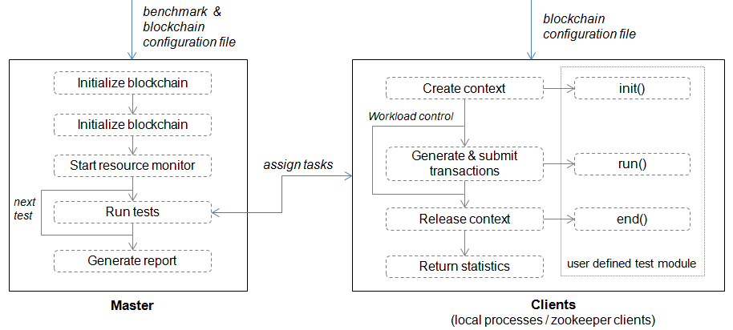
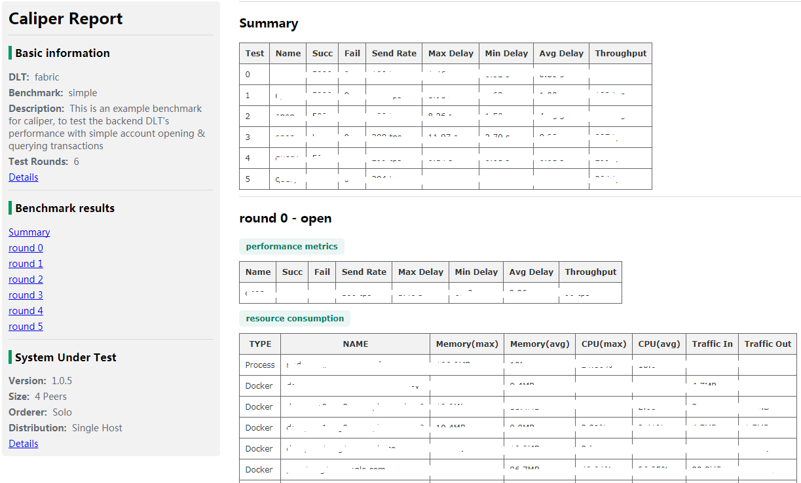

## Architecture


### Adaptation Layer

The adaptation layer is used to integrate existing blockchain system into Caliper framework. Each adaptor implements the 'Caliper Blockchain NBIs' by using corresponding blockchain's native SDK or RESTful API. Hyperledger Fabric1.0 and Sawtooth are current supported now, while Ethereum and other blockchain systems are in the plan.

### Interface&Core Layer

The interface&Core layer implements core functions and provides north bound interfaces for up-applications. Four kinds of NBIs are provided:
* *Blockchain operating interfaces:* contains operations such as deploying smart contracts on backend blockchain, invoking contracts, querying states from the ledger, etc.
* *Resource Monitor:* contains operations to start/stop a monitor and fetch resource consumption status of backend blockchain system, including CPU, memory, network IO, etc. Two kinds of monitors are provided now, one is to watch local/remote docker container, and another is to watch local processes. More monitors will be implemented in the future.
* *Performance Analyzer:* contains operations to read predefined performance statistics (including TPS, delay, success ratio, etc) and print benchmark results. Key metrics are recorded while invoking blockchain NBIs, e.g. created time and committed time of the transaction, result of the transaction, etc. Those metrics are used later to generate the statistics.
* *Report Generator:* contains operations to generate a HTML format testing report
   
### Application Layer

The application layer contains the tests implemented for typical blockchain scenarios. Each test has a configuration file which defines the backend blockchain network and test arguments. These tests can be used directly to test the performance of the blockchain system.

A default benchmark engine is implemented to help developers to understand the framework and implement their own test quickly. How to use the benchmark engine is explained in the latter part. Of course, developers can use NBIs directly to implement their test without the framework.


## Benchmark Engine




### Configuration File
 
Two kinds of configuration files are used. One is the benchmark configuration file, which defines the arguments of the benchmark like workload. Another is the blockchain configuration file, which specify necessary information to help interacting with the SUT.  

Below is a benchmark configuration file example:
```json
{
  "blockchain": {
    "type": "fabric",
    "config": "./fabric.json"
  },
  "command" : {
    "start": "docker-compose -f ../../network/fabric/simplenetwork/docker-compose.yaml up -d",
    "end" : "docker-compose -f ../../network/fabric/simplenetwork/docker-compose.yaml down;docker rm $(docker ps -aq)"
  },
  "test": {
    "name": "simple",
    "description" : "This is an example benchmark for caliper",
    "clients": {
      "type": "local",
      "number": 5
    },
    "rounds": [{
        "label" : "open",
        "txNumbAndTps" : [[5000,100], [5000,200], [5000,300]],
        "arguments": {  "money": 10000 },
        "callback" : "benchmark/simple/open.js"
      },
      {
        "label" : "open",
        "txNumbAndTps" : [[5000,400]],
        "arguments": {  "money": 10000 },
        "callback" : "benchmark/simple/open.js",
        "out" : "accounts"
      },
      {
        "label" : "query",
        "txNumbAndTps" : [[5000,300], [5000,400]],
        "arguments": {  "accounts":  "*#out" },
        "callback" : "benchmark/simple/query.js"
      }]
  },
  "monitor": {
    "type": ["docker", "process"],
    "docker":{
      "name": ["peer0.org1.example.com", "http://192.168.1.100:2375/orderer.example.com"]
    },
    "process": [
      {
        "command" : "node",
        "arguments" : "local-client.js",
        "multiOutput" : "avg"
      }
    ],
    "interval": 1
  }
}
```
* **blockchain** - defines the type of backend blockchain system and the configuration file for the adaptor to recognize the backend blockchain network with which to interact. See [*Farbic Config*](./Fabric%20Configuration.md) to learn more details.
* **command** - defines commands which will be called at particular phases of the test
  * **start** : be called at the beginning of the test
  * **end** : be called when finishing all tests
* **test** - defines the metadata of the test, as well as multiple test rounds with specified workload:
  * **name&description** : human readable name and description of the benchmark, the value is used by the report generator to show in the testing report.
  * **clients** : defines the client type as well as relevant arguments, the 'type' property must be 'local' or 'zookeeper'
    * local: In this case, local processes will be forked and act as blockchain clients. The number of forked clients should be defined by 'number' property.
    * zookeeper: In this case, clients could be located on different machines and take tasks from master via zookeeper. Zookeeper server address as well as the number of simulated blockchain clients which launch locally by zookeeper client should be defined. A example of zookeeper configuration defined is as below: 
      ```
      "type": "zookeeper",
      "zoo" : {
        "server": "10.229.42.159:2181",
        "clientsPerHost": 5
      }
      ```
  * **label** : hint for the test. For example, you can use the transaction name as the label name to tell which transaction is mainly used to test the performance. The value is also used as the context name for *blockchain.getContext()*. For example, developers may want to test performance of different Fabric channels, in that case, tests with different label can be bound to different fabric channels.  
  * **txNumbAndTps** : defines an array of sub-rounds with different transaction numbers or transaction generating speed. For example, [5000,400] means totally 5000 transactions will be generated and invoked at a speed of 400 transactions per second. In above example, actually six (not three) test rounds are defined.
  * **arguments** : user defined arguments which will be passed directly to the user defined test module. A reserved key string `*#out` is used to declare an argument with output of previous test round (see the explanation of *out* argument).
  * **callback** : specifies the user defined module used in this test round. Please see [User defined test module](#user-defined-test-module) to learn more details.
  * **out** : name of the output of this test rounds. If existed, the output of the user defined module will be cached for later use. If multiple sub-rounds are defined, those outputs will be concatenated as a single output.
* **monitor** - defines the type of resource monitors and monitored objects, as well as the time interval for the monitoring.
  * docker : a docker monitor is used to monitor specified docker containers on local or remote hosts. Docker Remote API is used to retrieve remote container's stats. Reserved container name 'all' means all containers on the host will be watched. In above example, the monitor will retrieve the stats of two containers per second, one is a local container named 'peer0.org1.example.com' and another is a remote container named 'orderer.example.com' located on host '192.168.1.100', 2375 is the listening port of Docker on that host.
  * process : a process monitor is used to monitor specified local process. For example, users can use this monitor to watch the resource consumption of simulated blockchain clients. The 'command' and 'arguments' properties are used to specify the processes. The 'multiOutput' property is used to define the meaning of the output if multiple processes are found. 'avg' means the output is the average resource consumption of those processes, while 'sum' means the output is the summing consumption.  
  * others : to be implemented.

### Master

The master implements a default test flow which contains three stages:

* Preparing stage: In this stage, the master creates and initializes an internal blockchain object with the blockchain configuration file, deploys smart contracts as specified in the configuration and starts a monitor object to monitor the resource consumption of backend blockchain system.

* Testing stage: In this stage, the master starts a loop to perform tests according to the benchmark configuration file. Tasks will be generated and assigned to clients according to the defined workload. Performance statistics return by clients will be stored for later analyzing.
    
* Reporting stage: Statistics from all clients of each test round are analyzed, and a HTML format report will be generated automatically. A report example is as below:



### Clients

#### Local clients

In this mode, the master uses Node.js cluster module to fork multiple local clients (child processes) to do the actual testing work. As Node.js is single-threaded by nature, local cluster could be useful to improve clients' performance on multi-core machine. 

The total workload are divided and assigned equally to child processes. A child process acts as a blockchain client with a temporarily generated context to interact with the backend blockchain system. The context usually contains the client's identity and cryptographic materials, and will be released when the testing task is finished.

* For Hyperledger Fabric, the context is also bound to a specific channel, the relationship is defined in fabric configuration file. 
  
The client invokes a test module which implements user defined testing logic.The module is explained later.

#### Zookeeper clients

In this mode, multiple zookeeper clients are launched independently. A zookeeper client will register itself after launch and watch for testing tasks. After testing, a znode which contains the result of performance statistics will be created.

A zookeeper client also forks multiple child processes to do the actual testing work. 

For more details, please refer to TBD.
 
### User defined test module

A test module implements functions that actually generate and submit transactions. By this way, developers can implement their own testing logic and integrate it with the benchmark engine.  

Three functions should be implemented and exported, all those functions should return a Promise object.

* `init` - Will be called by a client at the beginning of the test with a given blockchain object and context, as well as user defined arguments read from the benchmark configuration file. The blockchain object and context should be saved for later use, and other initialization work could be implemented in here.
* `run` - The actual transactions should be generated and submitted in here. The client will call this function repeatedly according to the workload. It is recommended that only one transaction is submitted by each call, but this is not a MUST requirement. If multiple transactions are submitted each time, the actual workload may be different with the configured workload. The function should be ran in asynchronous way.
* `end` - Will be called when the test is finished, any clearing work should be implemented in here. For benchmark with mutiple testing rounds, new clients will be generated for each testing round. So don't use local variables to save data across different testing rounds. One way to save such data is specifying the output in the benchmark configuration file and returning the data by this function. Please read the explanation of 'out' and 'arguments' of benchmark configuration file to learn how to set the property. Of course developers can use database or file systems to cache data by their own.


